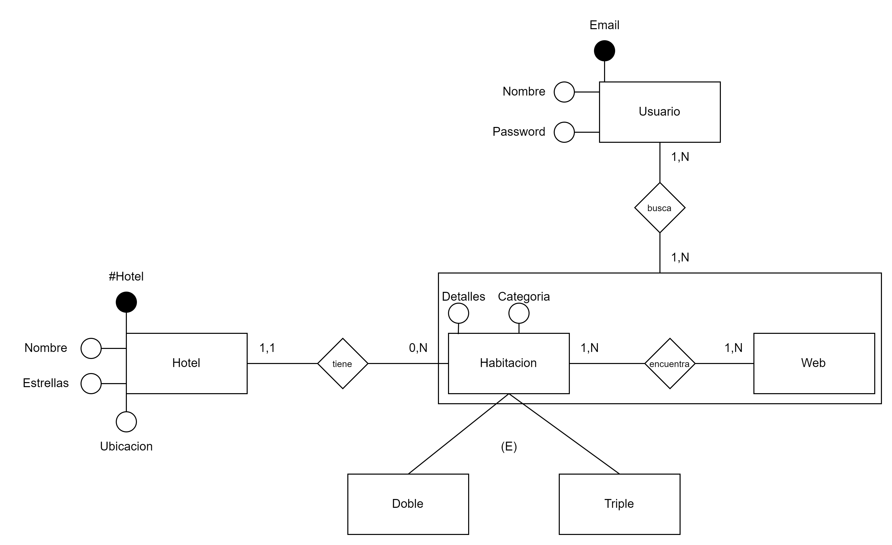
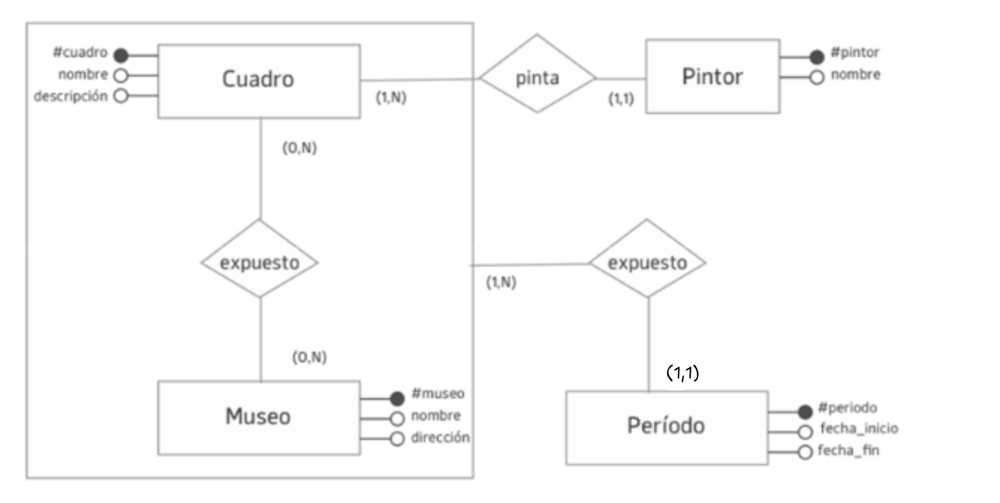
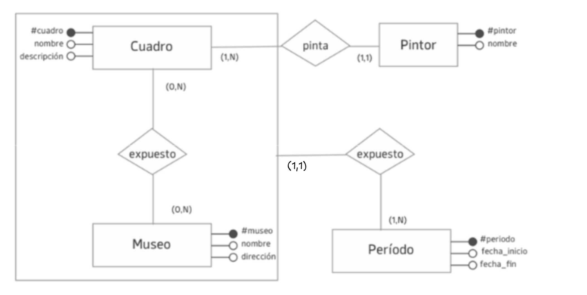

# Practica 1 PARTE I.

   

## Ejercicio 1 Análisis de un Modelo de E/R. Cuadros

a. En este modelo cada período de exposición contiene múltiples cuadros en museos. ¿Qué parte del modelo indica esto? ¿Cómo la modificaría para que cada período fuese exclusivo de cada cuadro expuesto en un museo? 

- Se puede aprecias en el modelo propuesto que se indica que cada período de exposición contiene múltiples cuadros en la parte de la agregacion cuando se indica que un cuadro puede estar expuesto en (0,N) muesos y un mueso puede tenes (0,N) cuadros lo que habilita a utilizar la agregacion para colocar la relacion junto al periodo.

- Yo propongo que para poder hacer que cad a periodo fuese exclusivo de cada cuadro entonces modificamos la cardinalidad de la realcion expuesto para que se interpete como que un cuadro expuesto en un mueso puede tener (1,N) periodos pero un periodo puede pertencer a (1,1) cuadro expuesto en un mueso. Por lo que entonces cambiamos la cardinalidad de Periodo a (1,1)

b. Si los cuadros se expusieran en un solo período dentro de cada museo ¿cómo ajustaría el modelo para reflejar esto? 

- Para poder lograr esto deberiamos cambiar la cardinalidad de la agregacion por (1,1) para poder decir que un cuadro expuesto en un mueso puede tener 1,1 periodo en un mueso

c. Ajuste el modelo para representar museos de dos tipos: de arte contemporáneo, con fecha de inauguración, país, director, curador a cargo y movimiento artístico; y de arte en general, del cual se conoce una fecha estimada de inauguración, país, director, restaurador principal y datos 

- Para logar esto tendriamos que hacer una especificacion del lado del mueso colocando los dos tipos de mueso en una especificacion (E): 

    ejemplo:

## Ejercicio 2 Verdadero/ Falso. Justificar

A.  En una especialización, la entidad padre no modela datos que realmente existan, sino que sirve para representar los aspectos comunes de las entidades hijas. F 

B.  En una agregación, la cardinalidad mínima debe ser mayor a 0  F

C.  Una entidad puede no tener un atributo identificador en el modelo ER F

D.  No es correcto modelar atributos en las relaciones en un modelo ER F
 

Para el diagrama de Entidades y Relaciones propuesto responda si las siguientes afirmaciones 
son verdaderas (V) o falsas (F). Justificar: 
 
A.  La relación tiene está mal definida, ya que debería ser entre persona y categoría_monotributo. F

B.  La relación realiza está bien definida, ya que todas las personas realizan actividades. V

C.  La jerarquía de Persona representa correctamente la problemática. F

D.  La relación pertenece está mal definida, ya que no puede haber atributos en las relaciones. V

E.  La agregación de la relación posee está correctamente definida ya que con una relación uno a muchos se puede agregar. 

F.  Con este diseño es posible conocer el saldo disponible del subsidio para futuras liquidaciones. 

G.  El modelo no tiene redundancia de datos