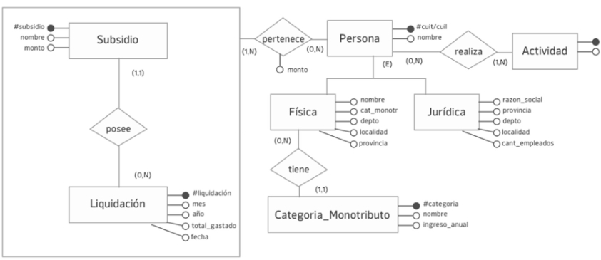
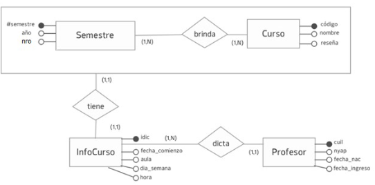

# Practica 1 PARTE I.

   

### Ejercicio 1 Análisis de un Modelo de E/R. Cuadros

a. En este modelo cada período de exposición contiene múltiples cuadros en museos. ¿Qué parte del modelo indica esto? ¿Cómo la modificaría para que cada período fuese exclusivo de cada cuadro expuesto en un museo? 

- Se puede aprecias en el modelo propuesto que se indica que cada período de exposición contiene múltiples cuadros en la parte de la agregacion cuando se indica que un cuadro puede estar expuesto en (0,N) muesos y un mueso puede tenes (0,N) cuadros lo que habilita a utilizar la agregacion para colocar la relacion junto al periodo.

- Yo propongo que para poder hacer que cad a periodo fuese exclusivo de cada cuadro entonces modificamos la cardinalidad de la realcion expuesto para que se interpete como que un cuadro expuesto en un mueso puede tener (1,N) periodos pero un periodo puede pertencer a (1,1) cuadro expuesto en un mueso. Por lo que entonces cambiamos la cardinalidad de Periodo a (1,1)

b. Si los cuadros se expusieran en un solo período dentro de cada museo ¿cómo ajustaría el modelo para reflejar esto? 

- Para poder lograr esto deberiamos cambiar la cardinalidad de la agregacion por (1,1) para poder decir que un cuadro expuesto en un mueso puede tener 1,1 periodo en un mueso

c. Ajuste el modelo para representar museos de dos tipos: de arte contemporáneo, con fecha de inauguración, país, director, curador a cargo y movimiento artístico; y de arte en general, del cual se conoce una fecha estimada de inauguración, país, director, restaurador principal y datos 

- Para logar esto tendriamos que hacer una especificacion del lado del mueso colocando los dos tipos de mueso en una especificacion (E): 

    ejemplo:

### Ejercicio 2 Verdadero/ Falso. Justificar

A.  En una especialización, la entidad padre no modela datos que realmente existan, sino que sirve para representar los aspectos comunes de las entidades hijas. F 

B.  En una agregación, la cardinalidad mínima debe ser mayor a 0  F

C.  Una entidad puede no tener un atributo identificador en el modelo ER F

D.  No es correcto modelar atributos en las relaciones en un modelo ER F
 
### Ejercicio 3 Verdadero/ Falso. Justificar

El  estado  nacional implementó  distintos  subsidios  destinados  a  sectores  productivos. Cada 
subsidio tiene un nombre y un monto asignado.  
 
Para cada subsidio se realiza una liquidación mensual, de la cual se registra a qué mes y año corresponde, el total gastado y la fecha de realización. En esta liquidación, a cada beneficiario del subsidio se  le liquida  un monto,  el cual  dependerá  de la situación  del  beneficiario. Un beneficiario puede ser una persona Jurídica o Física, y en el caso de la persona física, debe estar inscripta en el monotributo. De cada beneficiario se conoce la actividad económica en la cual se encuentra inscripto y su cuil o cuit que lo identifica. De las personas jurídicas se conoce la razón social, provincia, departamento, localidad y cantidad de empleados. De las personas físicas  se  conoce  nombre  y  apellido,  provincia,  departamento,  localidad  y  categoría  del monotributo. 
 
Para el diagrama de Entidades y Relaciones propuesto responda si las siguientes afirmaciones son verdaderas (V) o falsas (F). Justificar: 
 
A.  La relación tiene está mal definida, ya que debería ser entre persona y 
categoría_monotributo. 
B.  La relación realiza está bien definida, ya que todas las personas realizan actividades. 
C.  La jerarquía de Persona representa correctamente la problemática. 
D.  La relación pertenece está mal definida, ya que no puede haber atributos en las 
relaciones. 
E.  La agregación de la relación posee está correctamente definida ya que con una relación 
uno a muchos se puede agregar. 
F.  Con este diseño es posible conocer el saldo disponible del subsidio para futuras 
liquidaciones. 
G.  El modelo no tiene redundancia de datos. 

### 4 Análisis de un modelo de E/R. Vendedores 
 
Dado el siguiente modelo E/R sobre vendedores que trabajan en locales: 
 

A.   En qué casos modelaría un atributo fecha_de_ingreso en la relación se_emplea – entre Vendedor y Local - como se muestra en la variante “A”? 

Se modelaria la variante A en el caso en el que la fecha de ingreso sea unica y no te importe los valores que tenia antes.

B.  ¿En qué casos haría falta modelar una entidad Fecha de Ingreso relacionada con la 
agregación Vendedor Local como se muestra en la parte llamada B en el modelo? 

Se modelaria la variante B en el caso de querer tener un historial de las fechas de ingreso de cada empleado.

C.  ¿Qué se está modelando con Horario cuando está la agregación? Indíquelo agregando la cardinalidad correspondiente

Se esta modelando el horario que tiene que cumplir un empleado en un determinado local y las cardinalidad seria que en un horario trabajan 1,N empleados y un local tiene 1,1 horario.

### 5 Verdadero/Falso en Transformación del modelo de E/R al modelo Relacional. Cursos 
 
 

semestre (#semestre, nro, año) 
curso (codigo, nombre, reseña) 
profesor (cuil, nyap, fecha_nac, fecha_ingreso) 
infocurso (idic, fecha_comienzo, aula, día_semana, hora) 
brinda (#semestre, codigo) 
tiene (#semestre, codigo, idic) 
dicta (idic, cuil) 
 
Dada la transformación 1 a 1 del modelo de entidades y relaciones al modelo relacional, 
responda si las siguientes afirmaciones son V o F: 

A.  La relación brinda tiene los atributos correspondientes y su clave está bien definida. V

La relación brinda(#semestre, codigo) corresponde a una relación entre semestre y curso. Los atributos son correctos, y la clave primaria de esta relación es compuesta por (semestre, codigo), que identifica de manera única la relación entre un semestre y un curso.

B.  La relación tiene tiene los atributos correspondientes y su clave está bien definida. V 

La relación tiene(#semestre, codigo, idic) indica que un semestre y un curso están relacionados con un infocurso específico. La clave primaria de esta relación sería compuesta por (semestre, codigo, idic), que asegura la unicidad de la relación.

C.  La relación dicta tiene los atributos correspondientes y su clave está bien definida. F

La relación dicta(idic, cuil) relaciona un infocurso con un profesor. Los atributos son incorrectos estamos hablando que la cardinalidad maxima de profesor es 1 y la de infoCurso 1,N por lo que se deberia colocar el id unico de la entidad que tenga la caridnalidad maxima N.

D.  La relación tiene no debería existir y los identificadores de la agregación deberían estar en InfoCurso. F

La relación tiene es necesaria para enlazar Semestre y Curso con InfoCurso, permitiendo que se especifiquen las características del curso en un semestre específico. Eliminarla rompería la estructura conceptual correcta del modelo.

E.  La relación dicta no debería existir y los atributos de Profesor deberían estar en InfoCurso. F
 
Dicta es esencial para mantener la relación entre InfoCurso y Profesor. Incluir los atributos del profesor directamente en InfoCurso generaría redundancia de dato y romperia la normalización del esquema

# PARTE II

### Ejercicios de modelado

Para cada uno de los ejercicios propuestos, realizar: 
- el modelo conceptual (empleando E/R) 
- la transformación 1 a 1 del modelo de entidades y relaciones al modelo relacional.

### 6) Pozos Petroleros

Una compañía petrolera debe monitorear parámetros ambientales sobre los pozos en los que 
opera.  
Cada pozo se encuentra en una posición geográfica (latitud y longitud), tiene un nombre y una 
fecha  de puesta en producción. Sobre  cada pozo se realizan monitoreos periódicos con la 
intención de registrar distintas variables de interés y de los cuales se debe guardar la fecha del 
monitoreo y el método aplicado en el mismo. En cada monitoreo se miden diferentes parámetros 
(suelen repetirse entre mediciones), de los cuales se conoce un nombre y un valor de referencia. 
Además, en cada monitoreo, para cada parámetro específico, se obtiene un resultado, del cual 
se guarda el valor obtenido y el instrumento que se utilizó. Los instrumentos que se utilizan en 
los monitoreos pueden ser analógicos o digitales. De los analógicos se tiene la última fecha de 
calibración, y de los digitales se conoce la marca y modelo. De todos los instrumentos se conoce 
el número de serie.

