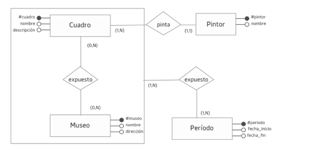
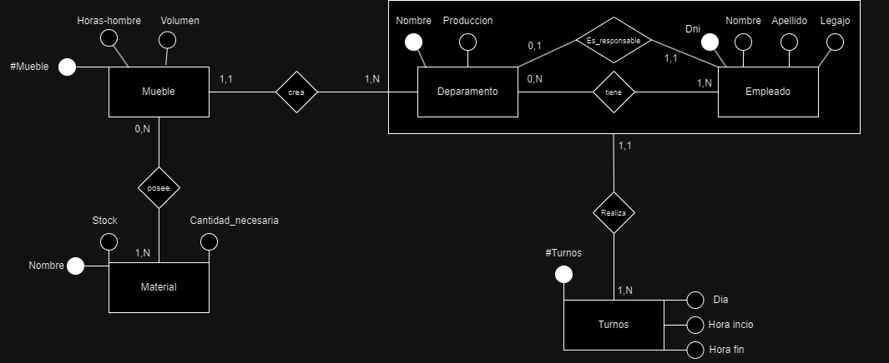
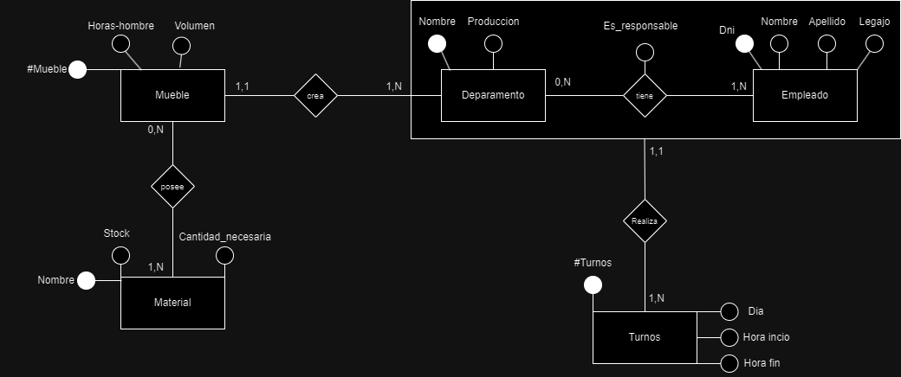

 # Practica 1 PARTE I.

   

## Ejercicio 1 Análisis de un Modelo de E/R. Cuadros

a. En este modelo cada período de exposición contiene múltiples cuadros en museos. ¿Qué parte del modelo indica esto? ¿Cómo la modificaría para que cada período fuese exclusivo de cada cuadro expuesto en un museo? 

- Se puede aprecias en el modelo propuesto que se indica que cada período de exposición contiene múltiples cuadros en la parte de la agregacion cuando se indica que un cuadro puede estar expuesto en (0,N) muesos y un mueso puede tenes (0,N) cuadros lo que habilita a utilizar la agregacion para colocar la relacion junto al periodo.

- Yo propongo que para poder hacer que cad a periodo fuese exclusivo de cada cuadro entonces modificamos la cardinalidad de la realcion expuesto para que se interpete como que un cuadro expuesto en un mueso puede tener (1,N) periodos pero un periodo puede pertencer a (1,1) cuadro expuesto en un mueso. Por lo que entonces cambiamos la cardinalidad de Periodo a (1,1)

b. Si los cuadros se expusieran en un solo período dentro de cada museo ¿cómo ajustaría el modelo para reflejar esto? 

- Para poder lograr esto deberiamos cambiar la cardinalidad de la agregacion por (1,1) para poder decir que un cuadro expuesto en un mueso puede tener 1,1 periodo en un mueso

c. Ajuste el modelo para representar museos de dos tipos: de arte contemporáneo, con fecha de inauguración, país, director, curador a cargo y movimiento artístico; y de arte en general, del cual se conoce una fecha estimada de inauguración, país, director, restaurador principal y datos 

- Para logar esto tendriamos que hacer una especificacion del lado del mueso colocando los dos tipos de mueso en una especificacion (E): 

    ejemplo:

## Ejercicio 2 Verdadero/ Falso. Justificar

A.  En una especialización, la entidad padre no modela datos que realmente existan, sino que sirve para representar los aspectos comunes de las entidades hijas. F 

B.  En una agregación, la cardinalidad mínima debe ser mayor a 0  F

C.  Una entidad puede no tener un atributo identificador en el modelo ER F

D.  No es correcto modelar atributos en las relaciones en un modelo ER F
 
### Ejercicio 3 Verdadero/ Falso. Justificar

Para el diagrama de Entidades y Relaciones propuesto responda si las siguientes afirmaciones 
son verdaderas (V) o falsas (F). Justificar: 
 
A.  La relación tiene está mal definida, ya que debería ser entre persona y categoría_monotributo. F

B.  La relación realiza está bien definida, ya que todas las personas realizan actividades. V

C.  La jerarquía de Persona representa correctamente la problemática. F

D.  La relación pertenece está mal definida, ya que no puede haber atributos en las relaciones. V

E.  La agregación de la relación posee está correctamente definida ya que con una relación uno a muchos se puede agregar. 

F.  Con este diseño es posible conocer el saldo disponible del subsidio para futuras 
liquidaciones. 

G.  El modelo no tiene redundancia de datos. 

### 4 Análisis de un modelo de E/R. Vendedores 
 
Dado el siguiente modelo E/R sobre vendedores que trabajan en locales: 
 

A.   En qué casos modelaría un atributo fecha_de_ingreso en la relación se_emplea – entre Vendedor y Local - como se muestra en la variante “A”? 

Se modelaria la variante A en el caso en el que la fecha de ingreso sea unica y no te importe los valores que tenia antes.

B.  ¿En qué casos haría falta modelar una entidad Fecha de Ingreso relacionada con la 
agregación Vendedor Local como se muestra en la parte llamada B en el modelo? 

Se modelaria la variante B en el caso de querer tener un historial de las fechas de ingreso de cada empleado.

C.  ¿Qué se está modelando con Horario cuando está la agregación? Indíquelo agregando la cardinalidad correspondiente

Se esta modelando el horario que tiene que cumplir un empleado en un determinado local y las cardinalidad seria que en un horario trabajan 1,N empleados y un local tiene 1,1 horario.

### 5 Verdadero/Falso en Transformación del modelo de E/R al modelo Relacional. Cursos 
 
 

semestre (#semestre, nro, año) 
curso (codigo, nombre, reseña) 
profesor (cuil, nyap, fecha_nac, fecha_ingreso) 
infocurso (idic, fecha_comienzo, aula, día_semana, hora) 
brinda (#semestre, codigo) 
tiene (#semestre, codigo, idic) 
dicta (idic, cuil) 
 
Dada la transformación 1 a 1 del modelo de entidades y relaciones al modelo relacional, 
responda si las siguientes afirmaciones son V o F: 

A.  La relación brinda tiene los atributos correspondientes y su clave está bien definida. V

La relación brinda(#semestre, codigo) corresponde a una relación entre semestre y curso. Los atributos son correctos, y la clave primaria de esta relación es compuesta por (semestre, codigo), que identifica de manera única la relación entre un semestre y un curso.

B.  La relación tiene tiene los atributos correspondientes y su clave está bien definida. V 

La relación tiene(#semestre, codigo, idic) indica que un semestre y un curso están relacionados con un infocurso específico. La clave primaria de esta relación sería compuesta por (semestre, codigo, idic), que asegura la unicidad de la relación.

C.  La relación dicta tiene los atributos correspondientes y su clave está bien definida. F

La relación dicta(idic, cuil) relaciona un infocurso con un profesor. Los atributos son incorrectos estamos hablando que la cardinalidad maxima de profesor es 1 y la de infoCurso 1,N por lo que se deberia colocar el id unico de la entidad que tenga la caridnalidad maxima N.

D.  La relación tiene no debería existir y los identificadores de la agregación deberían estar en InfoCurso. F

La relación tiene es necesaria para enlazar Semestre y Curso con InfoCurso, permitiendo que se especifiquen las características del curso en un semestre específico. Eliminarla rompería la estructura conceptual correcta del modelo.

E.  La relación dicta no debería existir y los atributos de Profesor deberían estar en InfoCurso. F
 
Dicta es esencial para mantener la relación entre InfoCurso y Profesor. Incluir los atributos del profesor directamente en InfoCurso generaría redundancia de dato y romperia la normalización del esquema

# PARTE II

### Ejercicios de modelado

Para cada uno de los ejercicios propuestos, realizar: 
- el modelo conceptual (empleando E/R) 
- la transformación 1 a 1 del modelo de entidades y relaciones al modelo relacional.

### 6) Pozos Petroleros

Una compañía petrolera debe monitorear parámetros ambientales sobre los pozos en los que opera.
Cada pozo se encuentra en una posición geográfica (latitud y longitud), tiene un nombre y una fecha de puesta en producción. Sobre cada pozo se realizan monitoreos periódicos con la intención de registrar distintas variables de interés y de los cuales se debe guardar la fecha del monitoreo y el método aplicado en el mismo. En cada monitoreo se miden diferentes parámetros (suelen repetirse entre mediciones), de los cuales se conoce un nombre y un valor de referencia. Además, en cada monitoreo, para cada parámetro específico, se obtiene un resultado, del cual se guarda el valor obtenido y el instrumento que se utilizó. Los instrumentos que se utilizan en los monitoreos pueden ser analógicos o digitales. De los analógicos se tiene la última fecha de calibración, y de los digitales se conoce la marca y modelo. De todos los instrumentos se conoce el número de serie.

- Pozos( **Latitud,Longitud** , Nombre, Fecha produccion) 
- Monitoreos(**#Monitoreo**,Fecha_Monitoreo,Metodo)
- Parametros(**Nombre**,Valor_ref)
- Analogicos(**Nro_serie**,Modelo,Marca)
- Digitales(**Nro_serie**,Fecha_Calibracion)
- Resultados(**#Resutlado**,Valor)
- Tiene(**Latitud,Longitud**,#Monitoreo)
- Obtiene(**#Resultado**,#Monitoreo,Nombre)
- Posee(**#Monitoreo**,**Nombre**)
- Utiliza(**Nro_serie**,#Resultado) (consultar esto)

### 7) Entrenamientos 

Una aplicación registra distintos entrenamientos de sus usuarios (correr, nadar, bicicleta, etc). Los usuarios que se registran aportan sus datos, como el email que lo identifica, su nombre, peso y altura. Los usuarios, al iniciar un entrenamiento inician un cronómetro que cuenta el tiempo total de entrenamiento de ese momento así como una estimación de las calorías consumidas. Cuando se corre, además de los datos anteriores, será necesario conocer la velocidad para tener el cálculo del promedio de velocidad en minutos/km.

Una funcionalidad de la aplicación que los usuario quisieran tener es la posibilidad de definir un objetivo de tiempo asignado a cada entrenamiento, del cual se guarda el tiempo a alcanzar y el porcentaje obtenido. Los usuarios también pueden obtener logros por su desempeño, y muchos de los logros pueden obtenerse varias veces, por ejemplo un mismo usuario puede obtener el logro por "racha de entrenamiento de 5 días" en diferentes fechas. De cada logro se guarda un nombre y una descripción, y cada vez que un usuario obtiene un premio, se guarda la fecha de obtención (si el premio es repetido, deben guardarse todas las fechas)

- Usuario(**Mail**,Nombre,Peso,Altura)
- Entrenamiento(**Tipo**,Tiempo,Calorias,Velocidad)
- Logro(**#Logro**,Desc,Nombre)
- Carrera()
- Objetivo(**#Objetivo**,Tiempo_a_alcanzar,Porcenaje)
- Fecha(**Dia,Mes,Año**)
- Realiza(**Mail,Tipo**)
- Define(**#Objetivo**,Mail,Tipo)
- Tiene(**Dia,Mes,Año,#Logro,Mail**)
- Obtiene(**#Logro,Mail**)

### 8) Empresa de Muebles 

Una empresa dedicada a la construcción de muebles para el hogar, desea poseer una base de datos para administrar la producción y la asignación horaria de sus empleados. 
La empresa está dividida en departamentos y en cada departamento se asignan empleados. Cada empleado puede trabajar en más de un departamento y en un departamento trabajan diversos empleados. Cada empleado realiza turnos para cada departamento en el que trabaja. Un empleado puede realizar más de un turno en cada departamento y en el mismo turno hay diversos empleados de un departamento. 
De los departamentos se conoce el nombre, el responsable (que es un empleado asignado al departamento) y la producción promedio del último año fiscal. De los empleados se conoce el nombre, el apellido, el dni y un número de legajo. De los turnos se conoce el día de la semana, la hora de inicio y la hora de fin. Cada departamento se especializa en la construcción de un tipo de mueble específico. De cada tipo de mueble se conocen la cantidad de horas-hombre promedio y el volumen que ocupa. Con el objetivo de llevar cuenta de los materiales necesarios para la construcción de cada tipo de mueble, se desea registrar los distintos materiales (diferentes tipos de madera, pegamento, tornillos, clavos, etc.). De cada material se conoce su nombre, el stock máximo que se puede tener, y la cantidad de dicho material necesario para cada tipo de mueble

Opcion 1 esta bien: 

Opcion 2 esta bien pero si se quiere luego armar algun tipo de historial no es posible:

- Mueble(**#Mueble**,Horas-hombre,Volumen)
- Material(**Nombre**,Stock,Cantidad_necesaria)
- Turnos(**#Turnos**,Dia,Hora inicio,Hora fin)
- Departamento(**Nombre**,Produccion)
- Empleado(**Dni**,Nombre,Apellido,Legajo)
- crea(**#Mueble**,Nombre,Dni)
- posee(**#Mueble,Nombre**)
- realiza(**#Turno**,Nombre,Dni)
- tiene(**Nombre,dni**,Es_responable)

### 9) Red Social 

En una red social hay usuarios que publican contenidos y realizan publicaciones. Los usuarios pueden crear álbumes y agregar a otros usuarios para que participen en los mismos. Cada usuario que participa en un álbum puede cargar varios contenidos, que pueden ser fotos o vídeos. De las fotos se conoce la resolución y el formato, mientras que de los videos se conoce la duración. De todo contenido se guarda un comentario y la fecha de publicación, y también debe ser posible saber qué usuario lo cargó. Para cada álbum, además de los participantes, es importante saber quién fue su creador, y también su fecha de creación, nombre y descripción. Los usuarios también realizan publicaciones. De cada publicación se guarda un texto, fecha de publicación y, opcionalmente, un contenido que puede ser una foto o un video (a lo sumo uno). Las publicaciones también contienen etiquetas que facilitan su búsqueda. Muchas publicaciones pueden tener la misma etiqueta, de la cual se conoce sólo un nombre. De cada usuario se conoce su nombre de usuario, email y nombre completo

**Perdi el archivo donde puedo corregir mi diagrama la correccion mas importante es que falta agregar la relacion participa de la agregacion es decir usuario participa en un album porque sino la gente que participa no puede cargar contenido**

- Etiqueta(**#Etiqueta**,Nombre)
- Usuario(**Email**,nombre,username)
- Publicacion(**#Publicacion**,Texto,Fecha_publicacion)
- Foto(**Contenido**,fecha_publicacion,comentario,Resolucion,Formato)
- Video(**Contenido**,fecha_publicacion,comentario,Duracion)
- Album(**#Album**,Fecha_creacion,Desc,Nombre)
- carga(**Contenido**,Email,#Album)
- publica(**Email**,#Publicacion)
- Tiene(**#Publicacion**,#Contenido)
- posee(**#Etiqueta,#Publicacion**)
- crea(**Email,#Album**)
- Agrega(**Email_owner,Email_invitado,#Album**)
- Participa(**Email,#Album**)

### 10) Hoteles 
Una aplicación se dedica a listar precios de hoteles publicados en diferentes sitios. Los usuarios de la aplicación pueden incluso hallar distintos precios de una misma habitación de un mismo hotel, según el sitio que lo publica. Cuando un usuario busca una habitación, especificando un rango de fechas y cantidad de personas, la aplicación lista los resultados. Cada resultado de búsqueda indica una habitación de un hotel y el sitio que la pública, junto con el precio por noche. De los hoteles se conoce el nombre, estrellas y donde se encuentran ubicados. Las habitaciones de un hotel pueden ser dobles o triples, aunque a veces se publican habitaciones de otras capacidades. Además, de cada habitación se conocen detalles y categoría, que no están estandarizadas y cada hotel define por su cuenta. El precio por noche de una habitación depende de cada sitio que lo publica, es decir, para una misma habitación de un mismo hotel, pueden haber varios sitios que publican el precio por noche. Este precio también varía con el tiempo, y es necesario llevar registro de los distintos precios en diferentes rangos de fechas, dado que las posteriores búsquedas se realizan para fechas distintas. De los usuarios se conoce el email, nombre y contraseña.

**Preguntar es confunso**

- Hotel (**#hotel**, nombre, estrellas, ubicación)

- Tiene (#hotel, **#habitación**)

- Habitación (**#habitación**, categoría, detalles, tipo)

- encuentra (**#web, #habitación**)

- web (**#sitio**, nombre)

- Busqueda (**#búsqueda**, fechas, cantidad)

- Busca (**#búsqueda, #usuario**)

- Usuario (**#Email**, nombre, Password)

- Realiza (**#Busqueda**,#Email)

### 11) Red de Farmacias 
Una red de farmacias desea mantener información acerca de los productos que comercializa, sus clientes, las ventas realizadas a sus clientes y los vendedores que trabajan en ella. La red de farmacias posee diferentes sucursales (farmacias) ubicadas en diferentes puntos estratégicos del país. Los productos pueden ser de droguería, perfumería o accesorios. En cada farmacia de la red, se pueden comercializar diferentes tipos de productos, y un tipo de producto se puede comercializar en diferentes farmacias de la red. De los clientes se conoce su nombre, sus domicilios y sus teléfonos. De los vendedores se conoce su nombre, número de legajo y fecha de ingreso a la red de farmacias. Un vendedor puede trabajar en más de una farmacia y en una farmacia pueden trabajar varios vendedores. Para cada vendedor se conoce en qué horario debe estar en cada farmacia. Se sabe que un vendedor puede trabajar en más de un turno para la misma sucursal.

