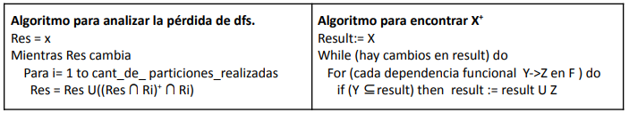

# Práctica Nro. 2
## Normalización

# PARTE I
### 1) Indicar la opción correcta. 

#### Dado el siguiente esquema:

    MapasPublicados (idMapa, proyección, escalaMapa, idSitioWeb, dominioSitioWeb,especialidadSitioWeb, dueñosSitioWeb, fechaPublicaciónMapa, valorPublicación)
    
    Donde:
    
    ● A un sitio web se le cobra un valor (“valorPublicación”) por cada fecha (“fechaPublicaciónMapa”) en la cual publique un mapa.

    ● Un sitio web puede tener varios dueños (“dueñosSitioWeb”).
    
    ● Un sitio web posee un único dominio (“dominioSitioWeb”).
    
    ● El identificador de un mapa (“idMapa”) es único.
    
    ● El identificador de un sitio web (“idSitioWeb”) es único.
    
    ● Un mapa se genera con una proyección y a una escala.
    
    ● “especialidadSitioWeb” es la especialidad de un sitio.

DF:

 * idMapa --> proyeccion,escalaMapa

 * idSitioWeb --> dominioSitioWeb,especialidadSitioWeb

 * idMapa,idSitioWeb,fechaPublicacion --> valorPublicacion

 * idMapa,dominioSitioWeb,fechaPublicacion --> valorPublicacion
    
 * dominioSitioWeb --> idSitioWeb,especialidadSitioWeb
    
Seleccione la frase que considera verdadera

● El esquema tiene una clave candidata

● El esquema tiene más de una clave candidata (Verdadera)

Son: 

 * { ID Mapa, ID Sitio Web, fecha Publicación Mapa, dueños Sitio web }
 * { ID Mapa, dominio Sitio Web, fecha Publicación Mapa, dueños Sitio web }

## 2. Clave candidata

### Dado el siguiente esquema donde se cumplen las siguientes dependencias funcionales df1 y df2:

    E(a, b, c, d, e, f)

    df1) a->b, c
    df2) c->d, e

    ¿Cuál de las siguientes CC es la correcta?
    
    1. CC(a,c}
    2. CC(a)
    3. CC(a,f)
    4. CC(a,c,f)
    5. CC(f)

## 3. Indicar la opción correcta

### Dada la relación:

    ALUMNO (DNI, nyAp, nroLegajo, promedio, #libroUsadoEnCarrera)
    
En la que se cumple las siguientes dependencias funcionales:
DF1) DNI → nyAp, nroLegajo, promedio
DF2) nroLegajo → nyAp, DNI, promedio
¿Cuál de las siguientes afirmaciones es correcta?
a) La relación ALUMNO tiene dos claves candidatas y tendrá dos claves primarias.
b) La relación ALUMNO tiene dos claves candidatas y tendrá una clave primaria.
c) No puedo identificar una clave.
d) Ninguna de las anteriores.

4. Dependencias funcionales

Dado el siguiente esquema:

    TIENDA (#aplicacion, nombre_aplicacion, descripcion, #categoria, #etiqueta, #desarrollador, nombre_apellido_desarrollador, #actualizacion descripcion_cambios)

Donde:

    ● #aplicacion, #categoria, #etiqueta y #desarrollador son únicos en el sistema.

    ● Una aplicación tiene un nombre y una descripción, y puede actualizarse muchas
    veces

    ● Para cada actualización de una aplicación se registra un texto con los cambios
    realizados. El #actualización es secuencial, cada aplicación define los suyos y
    puede repetirse entre distintas aplicaciones.

    ● Cada aplicación tiene una única categoría y muchas etiquetas. Las etiquetas
    pueden ir cambiando con cada actualización de la aplicación (en cada
    actualización puede haber un conjunto diferente de etiquetas). La categoría
    nunca cambia, es decir que se mantiene igual sin importar las actualizaciones.

    ● Una aplicación es realizada por varios desarrolladores de los cuales se conoce
    su nombre y apellido.

Seleccione las DFs válidas / mínimas: Para las que no se seleccionen, indicar el
motivo.

    1) #aplicacion, #actualizacion -> nombre_aplicacion, descripcion ✅
    2) #aplicacion, #actualizacion -> descripcion_cambios ✅
    3) nombre_apellido_desarrollador -> #desarrollador ❌
    4) #desarrollador -> nombre_apellido_desarrollador ✅
    5) #aplicación -> #categoria ✅

Encontró alguna dependencia funcional más, que no se menciona entre las opciones?

* CC `{ #aplicación, #actualización, #desarrollador, #etiqueta }`

5. Dependencias multivaluadas

Dado el siguiente esquema:

    CURSOS(#curso, titulo_curso, #nro_modulo, titulo_modulo, contenido_modulo,
    nombre_autor, email_autor, contraseña_autor, año_edicion, calificacion,
    referencia)

Donde:

    ● Cada curso (#curso) se va editando todos los años, y en cada año (año_edicion)
    puede cambiar sus módulos, no así el título y el autor.
    ● En cada año que se edita un curso, recibe varias calificaciones anónimas.
    ● El email de cada autor se usa como login, y no puede repetirse en el sistema.
    ● Los números de módulo (#nro_modulo) son secuenciales (modulo 1, 2, 3, etc).
    Es decir, en cada edición de cada curso se enumeran los módulos de la misma
    forma, y se pueden repetir en diferentes ediciones de cursos.
    ● Cada curso tiene múltiples referencias bibliográficas, que se mantienen a través
    de todas sus ediciones.

Dadas las siguientes DF:

    ● #curso -> titulo_curso, email_autor
    ● #curso, año_edicion, #nro_modulo -> titulo_modulo, contenido_modulo
    ● email_autor -> nombre_autor, contraseña_autor
    
    Dada la siguiente CC:
    
        ● (#curso, año_edicion, #nro_modulo, calificacion, referencia)
    
    Y el esquema en BCNF
    
        CURSOS_N (#curso, año_edicion, #nro_modulo, calificacion, referencia)

Seleccione las DM que son válidas a la vez en el esquema CURSOS_N:

    ● #curso ->> año_edicion
    ● #curso ->> referencia
    ● #curso,año_edicion ->> calificacion
    ● referencia ->> #curso
    ● año_edicion ->> #curso

Existe alguna dependencia multivaluada más que no se menciona entre las opciones?

# Parte II

### Dados los siguientes esquemas, realizar todo el proceso de normalización hasta 4FN.

    6. SUSCRIPCION (#suscripcion, email, nombre_usuario, #plan, nombre_plan,
    texto_condiciones, precio, email_adicional, nombre_adicional, #contenido, titulo,sinopsis, duracion, fecha_adicional)
    
    Donde:

        ● Cada suscripción es realizada por un único usuario (identificado por el email) y un plan, pero además hay usuarios adicionales que la utilizan (email_adicional). De cada usuario adicional que se suma a la suscripción, se guarda la fecha.

        ● Un plan de suscripción tiene un nombre (que no puede garantizarse que sea único en el sistema), condiciones, y un precio mensual.

        ● Cada contenido tiene un título, sinopsis y duración. El #contenido es único en el sistema, pero del título no puede garantizarse que lo sea.

        ● De cada suscripción se sabe qué contenidos fueron reproducidos, sin distinción sobre qué usuario (titular o adicionales) reprodujo cada uno.

DF:
    

    1- #suscripcion --> email,#plan
    2- email --> nombre_usuario
    3- #plan --> nombre_plan,texto_condiciones,precio
    4- #contendio --> titulo, sinopsis , duracion
    5- email_adicional --> nombre_adicional
    6- #suscripcion,email_adicional --> fecha_adicional
    

* CC `{#suscripcion,#contenido,email_adicional}`

#### Iteracion 1:

En este caso podemos ver que tenemos al menos una DF, por ej DF5, en la que X no sea superclave en el esquema

Particionamos el esquema usando la DF5 `email_adicinal --> nombre_adicional`

* F1(**email_adicional**,nombre_adicional)

* F2(**#suscripcion,email_adicional,#contenido**, email, nombre_usuario, #plan, nombre_plan texto_condiciones, precio, titulo,sinopsis, duracion, fecha_adicional)

F1 esta en BCNF porque solo vale la DF5 donde email_adicional es clave del esquema.
En F2 valen DF1, DF2,DF3, DF4,DF6 por validacion simple
F1 ⋂ F2 = email_adicional, que es clave en F1. Por lo tanto, no se perdió información.

    #suscripcion --> email,#plan
    email --> nombre_usuario
    #plan --> nombre_plan,texto_condiciones,precio
    #contendio --> titulo, sinopsis , duracion
    email_adicional --> nombre_adicional
    #suscripcion,email_adicional --> fecha_adicional

#### Iteracion 2:

F1 cumple con BCNF pero F2 sigue teniendo DF no triviales o en la que X no es una superclave

por lo que particionamos F2 siguiendo el esquema DF2

F3(**email**,nombre_usuario)
F4(**#suscripcion,email_adicional,#contenido**, email, #plan, nombre_plan texto_condiciones, precio, titulo,sinopsis, duracion, fecha_adicional)

F3 ⋂ F4 --> email no perdemos informacion
En F4 valen DF1,DF3,DF4,DF5 por validacion simple

    #suscripcion --> email,#plan
    email --> nombre_usuario
    #plan --> nombre_plan,texto_condiciones,precio
    #contendio --> titulo, sinopsis , duracion
    email_adicional --> nombre_adicional
    #suscripcion,email_adicional --> fecha_adicional

#### Iteracion 3

F3 cumple con BCNF pero F4 no cumple BCNF ya que sigue teniendo DF las cuales X no es superclave
por lo que particionamos usando la DF3

F4(**#Plan**,nombre_plan,text_condiciones,precio)
F5(**#suscripcion,email_adicional,#contenido**, email, #plan, titulo,sinopsis, duracion, fecha_adicional)

F4 ⋂ F5 --> #Plan no perdemos informacion
En F5 valen DF1,DF4,DF6

#### Iteracion 4

F4 cumple con BCNF pero F5 no cumple ya que sigue teniendo DF de las cuales X no es superclave por lo que particionamos usando la DF4

F5(**#Contendio**,titulo,sinopsis,duracion)
F6(**#suscripcion,email_adicional,#contenido**, email, #plan,fecha_adicional)

F5 ⋂ F6 --> #Contenido no perdemos informacion
En F6 valen DF1,DF6

#### Iteracion 5
F5 cumple con BCNF pero F6 sigue teniendo DF de las cuales X no es superclave

F7(**#Suscripcion**,email,#plan)
F8(**#suscripcion,email_adicional,#contenido**,fecha_adicional)

F7 ⋂ F8 --> #Contenido no perdemos informacion
En F8 valen DF6

#### Iteracion 6

F7 cumple con BCNF pero F8 sigue teniendo DF de las cuales X no es superclave
por lo que particionamos usando la DF6

F9(**#suscripcion,email_adicional**,fecha_adicional)
F10(**#suscripcion,email_adicional,#contenido**)

F9 ⋂ F10 --> #suscripcion,email_adicional no perdemos informacion

Y con esta ultima iteracion tenemos como resultado

* F1(**email_adicional**,nombre_adicional)
* F3(**email**,nombre_usuario)
* F4(**#plan**,nombre_plan,text_condiciones,precio)
* F5(**#contendio**,titulo,sinopsis,duracion)
* F7(**#suscripcion**,email,#plan)
* F9(**#suscripcion,email_adicional**,fecha_adicional)
* F10(**#suscripcion,email_adicional,#contenido**)

ahora cada tabla se encuentra en BCNF

