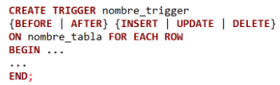

## CONSULTAS SQL

### Llevar a SQL las siguientes consultas antes realizadas en Álgebra Relacional:

#### 1. Dado el siguiente esquema:

    DUEÑO(id_dueño,nombre,teléfono,dirección,dni)
    CHOFER(id_chofer,nombre,teléfono,dirección,fecha_licencia_desde,
    fecha_licencia_hasta,dni)
    AUTO(patente,id_dueño,id_chofer,marca,modelo,año)
    VIAJE(patente,hora_desde,hora_hasta,origen,destino,tarifa,metraje)

#### a. Listar el dni, nombre y teléfono de todos los dueños que NO son choferes

```sql

    SELECT d.dni, d.nombre, d.telefono
    FROM DUEÑO d
    WHERE d.dni NOT IN (SELECT c.dni FROM CHOFER c);

```

#### b. Listar la patente y el id_chofer de todos los autos a cuyos choferes les caduca la licencia el 01/01/2024

```sql

    SELECT a.patente , a.id_chofer 
    FROM AUTO a 
    INNER JOIN CHOFER c ON (a.id_chofer = c.id_chofer)
    WHERE (c.fache_licencia_hasta = "01/01/2024" );

```


    ESTUDIANTE(#legajo,nombreCompleto,nacionalidad,añoDeIngreso,códigoDeCarrera)
    CARRERA(códigoDeCarrera,nombre)
    INSCRIPCIONAMATERIA(#legajo,códigoDeMateria)
    MATERIA(códigoDeMateria,nombre)

#### a. Obtener el nombre de los estudiantes que ingresaron en 2019.

```sql

    SELECT e.legajo,e.nombreCompleto,e.nacionalidad,e.añoDeIngreso,e.codigoDeCarrera
    FROM ESTUDIANTE e
    WHERE (e.añoDeIngreso = 2019)

```


#### b. Obtener el nombre de los estudiantes con nacionalidad “Argentina” que NO estén en la carrera con código “LI07”

```sql

    SELECT e.dni
    FROM ESTUDIANTE e
    WHERE e.nacionalidad = "Argentina" 
    AND e.dni NOT IN (SELECT e.dni
              FROM ESTUDIANTE e
              WHERE (e.códigoDeCarrera = "LI07" ));

```
No se que tan bien esta esto otra forma podria ser esta?
```sql

    SELECT e.dni
    FROM ESTUDIANTE e
    WHERE e.nacionalidad = "Argentina" 
    AND  e.códigoDeCarrera <> "LI07" );

```


Compare las resoluciones de estos ejercicios con las realizadas en álgebra relacional, que paralelismo encuentra entre las diferentes operaciones de AR en SQL y en las formas de las resoluciones?

Ambos enfoques, álgebra relacional y SQL, buscan lograr los mismos objetivos pero con diferentes sintaxis y estructuras. Las operaciones de selección (σ en AR) y proyección (Π en AR) tienen su equivalente en las cláusulas WHERE y SELECT en SQL. Las uniones y diferencias de conjuntos en álgebra relacional se traducen en JOINs y condiciones de exclusión (NOT IN, <>) en SQL.

### PREPARACIÓN BD


Un hospital posee una base de datos para almacenar información sobre las atenciones que
se realizan para sus pacientes, además de los doctores que los atendieron en cada
atención y los medicamentos que le fueron recetados.
El esquema con el que cuentan es el siguiente:

    APPOINTMENTS(patient_id,patient_name,patient_address,patient_city,primary_phone,
    secondary_phone,doctor_id,doctor_name,doctor_address,doctor_city,doctor_speciality,
    appointment_date,appointment_duration,observations,payment_card,contact_phone,
    medication_name)

Clave candidata del esquema APPOINTMENTS:

    CC:(patient_id,doctor_id,appointment_date,medication_name)

Dependencias funcionales válidas en el esquema APPOINTMENTS:

    DF1: patient_id -> patient_name, patient_address, patient_city, primary_phone,
    secondary_phone
    DF2: doctor_id-> doctor_name,doctor_address,doctor_city,doctor_speciality
    DF3: patient_id, appointment_date -> appointment_duration, contact_phone,
    observations, payment_card

Dependencias multivaluadas válidas en el esquema APPOINTMENTS:

    DM1: patient_id, appointment_date ->> doctor_id
    DM2: patient_id, appointment_date ->> medication_name
    Luego de haber aplicado el proceso de normalización quedan las siguientes particiones en
    4FN:
    PATIENT(patient_id,patient_name,patient_address,patient_city,primary_phone,
    secondary_phone)
    DOCTOR(doctor_id,doctor_name,doctor_address,doctor_city,doctor_speciality)
    APPOINTMENT(patient_id,appointment_date,appointment_duration,contact_phone,
    observations,payment_card)
    MEDICAL_REVIEW(patient_id,appointment_date,doctor_id)
    PRESCRIBED_MEDICATION(patient_id,appointment_date,medication_name)

Y la siguiente Clave Primaria:

    CP = (patient_id, doctor_id, appointment_date, medication_name)

Se proveen dos archivos separados con lo necesario para la creación de las tablas e
inserción de datos. Ambos archivos se encuentran en el archivo comprimido
apppointments.sql.zip adjunto a esta práctica.

Para crear los esquemas y cargar los datos, hacerlo desde línea de comando. Para esto,
descomprimir los archivos y ejecutar desde la terminal el siguiente comando para acceder a
la terminal mysql:

    mysql -h localhost -u root -p

dentro de la terminal mysql, crear ambos esquemas:

    mysql> create database appointments;
    mysql> exit;
    
nuevamente en la terminal, ejecutar los scripts que contienen ambos archivos:
‘appointments.sql’ creará las tablas, mientras que ‘insert_appointments.sql’ crea una serie
de tuplas de ejemplo para poder realizar las consultas.

    mysql appointments -h localhost -u root -p < ruta_del_archivo

donde ruta_del_archivo es el path al archivo provisto.
Nota: Debe ingresar la contraseña del usuario root por cada comando que ejecute en
nombre de este.

EJERCICIOS
1. Crea un usuario para las bases de datos usando el nombre ‘appointments_user’.
Asigne a estos todos los permisos sobre sus respectivas tablas. Habiendo creado
este usuario evitaremos el uso de ‘root’ para el resto del trabajo práctico.
Adicionalmente, con respecto a esta base de datos:

a. Cree un usuario sólo con permisos para realizar consultas de selección, es
decir que no puedan realizar cambios en la base. Use el nombre
‘appointments_select’.

```sql
CREATE USER 'appointments_select'@'localhost' IDENTIFIED BY 'admin';
GRANT SELECT ON mibase.* TO 'appointments_select'@'localhost';
```

b. Cree un usuario que pueda realizar consultas de selección, inserción,
actualización y eliminación a nivel de filas, pero que no puedan modificar el
esquema. Use el nombre ‘appointments_update’.

```sql

CREATE USER 'appointments_update'@'localhost' IDENTIFIED BY 'admin1'; 
GRANT SELECT, INSERT, UPDATE, DELETE ON mibase.* TO 'appointments_update'@'localhost';

```

c. Cree un usuario que tenga los permisos de los anteriores, pero que además
pueda modificar el esquema de la base de datos. Use el nombre
'appointments_schema’.

```sql

CREATE USER 'appointments_schema'@'localhost' IDENTIFIED BY 'admin2'; 
GRANT SELECT, INSERT, UPDATE, DELETE,CREATE, ALTER, DROP ON mibase.* TO 'appointments_schema'@'localhost';

```

2. Hallar aquellos pacientes que para todas sus consultas médicas siempre hayan
dejado su número de teléfono primario (nunca el teléfono secundario).

```sql

    SELECT *
    FROM patient p
    WHERE  NOT EXISTS (
        SELECT * FROM patient p1
        INNER JOIN appointment a ON a.patient_id = p1.patient_id 
        WHERE a.contact_phone = p.secondary_phone
    );


```

3. Crear una vista llamada ‘doctors_per_patients’ que muestre los id de los pacientes y
los id de doctores de la ciudad donde vive el cliente.


```sql

    CREATE VIEW new_schema.doctors_per_patients AS 
    SELECT p.patient_id, d.doctor_id 
    FROM patient p
    LEFT JOIN medical_review mr ON p.patient_id = mr.patient_id // sin importar si tiene atenciones, tiene que estar
    INNER JOIN doctor d ON d.doctor_id = mr.doctor_id
    WHERE p.patient_city = d.doctor_city;


    PROBAR:
    SELECT p.patient_id, d.doctor_id
    FROM patient p 
    INNER JOIN doctor d ON p.patient_city = d.doctor_city;

```

4. Hallar los pacientes (únicamente es necesario su id) que se atendieron con todos los
doctores de la ciudad en la que viven

a. Realice la consulta sin utilizar la vista creada anteriormente

```sql
    SELECT p.patient_id
    FROM patient p
    INNER JOIN medical_review mr ON p.patient_id = mr.patient_id
    INNER JOIN doctor d ON d.doctor_id = mr.doctor_id AND p.patient_city = d.doctor_city
    GROUP BY p.patient_id, p.patient_city
    HAVING COUNT(DISTINCT d.doctor_id) = (
        SELECT COUNT(DISTINCT d2.doctor_id)
        FROM doctor d2
        WHERE d2.doctor_city = p.patient_city
    );

    // Probar hacerlo con doble NOT IN (analogo a doble not exists)
```

b. Realice la consulta utilizando la vista creada anteriormente 


```sql

    SELECT v.patient_id
    FROM new_schema.doctors_per_patients v
    GROUP BY v.patient_id
    HAVING COUNT(DISTINCT v.doctor_id) = (
        SELECT COUNT(DISTINCT d.doctor_id) 
        FROM doctor d
        WHERE d.doctor_city = (
            SELECT p.patient_city 
            FROM patient p
            WHERE p.patient_id = v.patient_id
        )
    );

```

Restricción: resolver este ejercicio sin usar la cláusula “NOT EXIST”.


5. Agregar la siguiente tabla:

APPOINTMENTS_PER_PATIENT
idApP: int(11) PK AI
id_patient: int(11)
count_appointments: int(11)
last_update: datetime
user: varchar(16)


```sql
    CREATE TABLE `appointments_per_patient` (
    `idApP` INT(11) PRIMARY KEY AUTO_INCREMENT,
    `id_patient` INT(11),
    `count_appointments` INT(11),
    `last_update` DATETIME,
    `user` VARCHAR(255)
    );
```

6. Crear un Stored Procedure que realice los siguientes pasos dentro de una
transacción:

a. Realizar una consulta que para cada pacient (identificado por id_patient),
calcule la cantidad de appointments que tiene registradas. Registrar la fecha
en la que se realiza esta carga y además del usuario con el se realiza.

```sql

    DELIMITER //

        -- DROP TABLE IF EXISTS appointments_per_patient;
        -- DROP PROCEDURE IF EXISTS calcular_cantidad_appointments;
        CREATE PROCEDURE calcular_cantidad_appointments ()
        BEGIN
            
            START TRANSACTION;
            
                -- CREATE TABLE IF NOT EXISTS appointments_per_patient (
                --     idApP INT AUTO_INCREMENT PRIMARY KEY,
                --     patient_id INT NOT NULL,
                --     count_appointments INT NOT NULL,
                --     last_update DATETIME NOT NULL,
                --     user VARCHAR(255) NOT NULL
                -- );

            INSERT INTO appointments_per_patient (patient_id, count_appointments, last_update, user)
            SELECT p.patient_id, COUNT(*) AS count_appointments, NOW() AS last_update, p.patient_name
            FROM patient p
            INNER JOIN medical_review mr ON p.patient_id = mr.patient_id
            GROUP BY p.patient_id;

            COMMIT;
        END //

    DELIMITER ;


```

b. Guardar el resultado de la consulta en un cursor.
c. Iterar el cursor e insertar los valores correspondientes en la tabla
APPOINTMENTS PER PATIENT.

```sql

     DELIMITER //

        -- DROP TABLE IF EXISTS appointments_per_patient;
        -- DROP PROCEDURE IF EXISTS calcular_cantidad_appointments;
        CREATE PROCEDURE calcular_cantidad_appointments (
        )
        BEGIN
            DECLARE done INT DEFAULT 0;
            DECLARE patient_id INT;
            DECLARE count_appointments INT;

            -- si el paciente no tiene atenciones, tendria que quedar 0. modificar a left join
            DECLARE cur CURSOR FOR
            SELECT p.patient_id, COUNT(*) AS count_appointments
            FROM patient p
            INNER JOIN medical_review mr ON p.patient_id = mr.patient_id
            GROUP BY p.patient_id;

            DECLARE CONTINUE HANDLER FOR NOT FOUND SET done = 1;
            
           
            START TRANSACTION;
			
            
            OPEN cur;

            loop_iteration : LOOP
                FETCH cur INTO patient_id,count_appointments; -- ITERO POR LOS VALORES DE LA CONSULTA QUE PUSE EN EL CURSOR
                IF done THEN
                    LEAVE loop_iteration;
                END IF;

                INSERT INTO appointments_per_patient (patient_id, count_appointments, last_update, user) -- ACA EL NOMBRE DE CADA COLUM
                VALUES (patient_id, count_appointments, NOW(), CURRENT_USER()); -- ACA EL VALOR DE LOS ELEMENTOS
                
            END LOOP;
			CLOSE cur;
			COMMIT;
        END //

    DELIMITER ; 

```
```sql
    DECLARE cur CURSOR FOR CONSULTA

    OPEN cur;

        loop_iteration : LOOP
            IF done THEN
                LEAVE loop_iteration;

            ITERO
            SE PONE UN INSERT TABLA (COLUMNAS CON EL NOMBRE correspondientes)
            VALUES (VALORES REALES QUE SE OPTIENEN DE LA CONSULTA)
            ON DUPLICATE KEY UPDATE
                actualizo si existe ya la fila

        END LOOP;
```

7. Crear un Trigger de modo que al insertar un dato en la tabla Appointment, se
actualice la cantidad de appointments del paciente, la fecha de actualización y el
usuario responsable de la misma (actualiza la tabla APPOINTMENTS PER
PATIENT).



```sql

    DELIMITER //

    CREATE TRIGGER actualizar_appointment
    AFTER INSERT 
    ON appointment FOR EACH ROW
    BEGIN
        
        DECLARE appointment_count INT;
        SELECT COUNT(*) INTO appointment_count
        FROM appointments_per_patient
        WHERE patient_id = NEW.patient_id;
        
        IF appointment_count = 0 THEN

            INSERT INTO appointments_per_patient (patient_id, count_appointments, last_update, user)
            VALUES (NEW.patient_id, appointment_count, NOW(), CURRENT_USER());
        ELSE
            UPDATE appointments_per_patient
            SET count_appointments = count_appointments + 1,
                last_update = NOW(),
                user = CURRENT_USER()
            WHERE patient_id = NEW.patient_id;
		END IF;
    END // 

    DELIMITER ;

```

8. Crear un stored procedure que sirva para agregar un appointment, junto el registro
de un doctor que lo atendió (medical_review) y un medicamento que se le recetó
(prescribed_medication), dentro de una sola transacción. El stored procedure debe
recibir los siguientes parámetros: patient_id, doctor_id, appointment_duration,
contact_phone, appointment_address, medication_name. El appointment_date será
la fecha actual. Los atributos restantes deben ser obtenidos de la tabla Patient (o
dejarse en NULL).


```sql
DELIMITER //
    CREATE PROCEDURE agregar_appoinment (
        IN patient_id INTEGER,
        IN doctor_id INTEGER,
        IN appointment_duration FLOAT,
        IN contact_phone VARCHAR(15),
        IN appointment_address VARCHAR(255),
        IN medication_name VARCHAR(255)
    )
    BEGIN
    DECLARE patient_name VARCHAR(255);
    DECLARE patient_city VARCHAR(255);
    DECLARE appointment_date DATETIME;
    SET appointment_date = NOW();
    
    START TRANSACTION;

    SELECT patient_name, patient_city
    INTO patient_name, patient_city
    FROM patient p
    WHERE p.patient_id = patient_id;
    
    INSERT INTO appointment (patient_id, appointment_date, appointment_duration, contact_phone, observations, payment_card);
    VALUES (patient_id, appointment_date, appointment_duration, contact_phone, appointment_address, NULL);
    
    INSERT INTO medical_review(patient_id,appointment_date,doctor_id);
    VALUES (patient_id, appointment_date ,doctor_id);

    INSERT INTO prescribed_medication(patient_id, appointment_date,medication_name);
    VALUES (patient_id,appointment_date,medication_name);

    COMMIT;

    END //

DELIMITER;

```

9. Ejecutar el stored procedure del punto 8 con los siguientes datos: 

patient_id: 10004427
doctor_id: 1003
appointment_duration: 30
contact_phone: +54 15 2913 9963
appointment_address: ‘Hospital Italiano’
medication_name: ‘Paracetamol’

<!-- poner la instruccion CALL -->

10. Considerando la siguiente consulta:

select count(a.patient_id)
from appointment a,patient p,doctor d,medical_review mr
where a.patient_id = p.patient_id
and a.patient_id=mr.patient_id
and a.appointment_date=mr.appointment_date
and mr.doctor_id=d.doctor_id
and d.doctor_speciality=‘Cardiology’
and p.patient_city=Rosario

Analice su plan de ejecución mediante el uso de la sentencia EXPLAIN.

a. ¿Qué atributos del plan de ejecución encuentra relevantes para evaluar la
performance de la consulta?

b. Observe en particular el atributo type ¿cómo se están aplicando los JOIN
entre las tablas involucradas?

c. Según lo que observó en los puntos anteriores, ¿qué mejoras se pueden
realizar para optimizar la consulta?

d. Aplique las mejoras propuestas y vuelva a analizar el plan de ejecución.
¿Qué cambios observa?
5